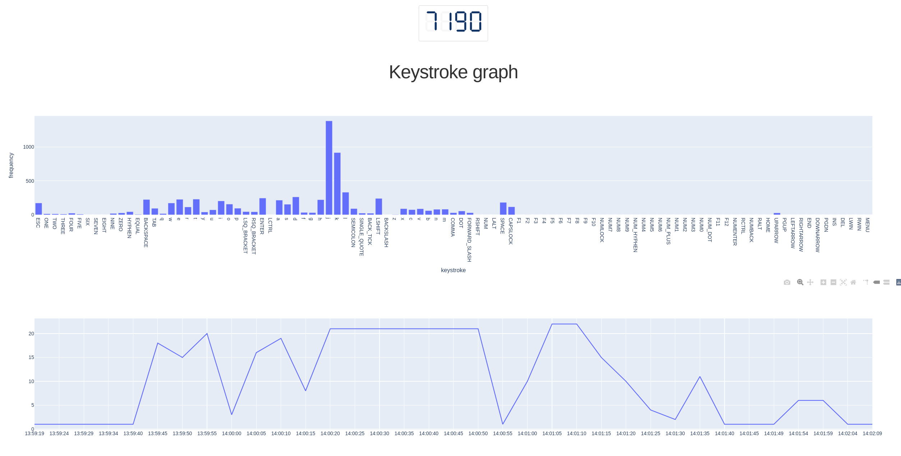

# keystrokestat :keyboard:

A tool for silent keystroke logging in the background using `xinput`

## Under development :exclamation:
> take a look at previous commits for complete working code 

## Screenshot at localhost:8050
> The state doesn't get updated in realtime. The page needs to be refereshed to load the recent data :neutral_face:



## Motivation

I wanted to know how much typing I do and what keys I'm using more

### Security implications

All the keystrokes are recorded! including the passwords and username that you type. Use at your own risk.

## Requirements

+ `xinput` 
    + installation for xinput varies from distro to distro
+ `dash, dash-daq and pandas` for interactive graph
    + install using `pip install -r requirements.txt`


## How to

The device ID for the keyboard is required to log the keystrokes. You can get 
the device ID from terminal by running `xinput`. In my case the device ID is `19`


```bash
[blue@linux] ~ xinput
⎡ Virtual core pointer                    	    id=2	[master pointer  (3)]
⎜   ↳ Virtual core XTEST pointer              	id=4	[slave  pointer  (2)]
⎜   ↳ Logitech M720 Triathlon                 	id=11	[slave  pointer  (2)]
⎜   ↳ Logitech K850                           	id=18	[slave  pointer  (2)]
⎣ Virtual core keyboard                   	    id=3	[master keyboard (2)]
    ↳ Virtual core XTEST keyboard             	id=5	[slave  keyboard (3)]
    ↳ Power Button                            	id=6	[slave  keyboard (3)]
    ↳ Video Bus                               	id=7	[slave  keyboard (3)]
    ↳ Power Button                            	id=8	[slave  keyboard (3)]
    ↳ Sleep Button                            	id=9	[slave  keyboard (3)]
    ↳ Logitech M720 Triathlon                 	id=13	[slave  keyboard (3)]
    ↳ Logitech K850                           	id=19	[slave  keyboard (3)]
    ↳ Mi TV soundbar (AVRCP)                  	id=10	[slave  keyboard (3)]
```


```bash
# starts xinput in the background
[blue@linux] ~ python keystroke.py --run 

# to start the dash server
[blue@linux] ~ python keystroke.py --stats

# for killing the xinput process running in the background
[blue@linux] ~ python keystroke.py --kill

```

> Tested on Ubuntu 20.04.1 LTS


### Take a look at my personal [stats](./assets/stats.md)

> The reason why you see high frequency for j, k, l, h are because of `vi` usage
> I was quite suprised myself to see the stat :blush: 


## Finally

Let you me know what you think about this. You can share your thoughts with me on [twitter](https://twitter.com/neelabalan)
