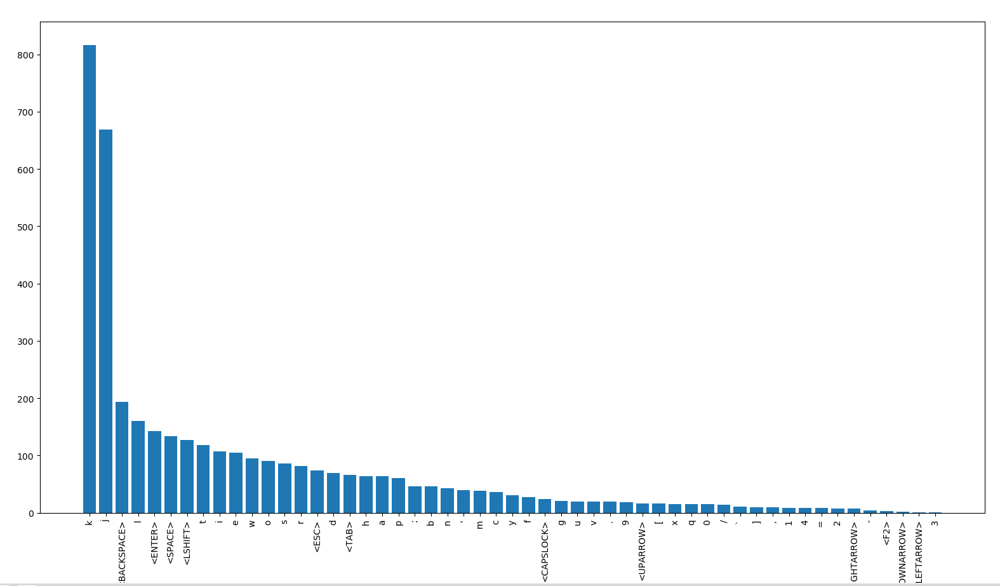

# keystrokestat :keyboard:

A tool for silent keystroke logging in the background using `xinput`


## Motivation

I wanted to know how much typing I do and what keys I'm using more


## Requirements

+ `xinput` 
    + installation for xinput varies from distro to distro
+ `pytablewriter` for markdown table output
    + install using `pip3 install pytablewriter`


## Installation

```bash
git clone git.github.com/neelabalan/keystrokestat
cd keystrokestat
pip3 install -r requirements.txt
```


## How to

The device ID for the keyboard is required to log the keystrokes. You can get 
the device ID from terminal by running `xinput`. In my case the device ID is `19`


```bash
[blue@linux] ~ xinput
⎡ Virtual core pointer                    	    id=2	[master pointer  (3)]
⎜   ↳ Virtual core XTEST pointer              	id=4	[slave  pointer  (2)]
⎜   ↳ Logitech M720 Triathlon                 	id=11	[slave  pointer  (2)]
⎜   ↳ Logitech K850                           	id=18	[slave  pointer  (2)]
⎣ Virtual core keyboard                   	    id=3	[master keyboard (2)]
    ↳ Virtual core XTEST keyboard             	id=5	[slave  keyboard (3)]
    ↳ Power Button                            	id=6	[slave  keyboard (3)]
    ↳ Video Bus                               	id=7	[slave  keyboard (3)]
    ↳ Power Button                            	id=8	[slave  keyboard (3)]
    ↳ Sleep Button                            	id=9	[slave  keyboard (3)]
    ↳ Logitech M720 Triathlon                 	id=13	[slave  keyboard (3)]
    ↳ Logitech K850                           	id=19	[slave  keyboard (3)]
    ↳ Mi TV soundbar (AVRCP)                  	id=10	[slave  keyboard (3)]
```


```bash
# starts xinput in the background
[blue@linux] ~ python3 keystroke.py --run 19

# prints markdown table with keystroke frequency and percentage 
[blue@linux] ~ python3 keystroke.py --stats

# for killing the xinput process running in the background
[blue@linux] ~ python3 keystroke.py --kill

# export to markdown
[blue@linux] ~ python3 keystroke.py --stats > stats.md

```

> Tested on Ubuntu 20.04.1 LTS


### Take a look at my personal [stats](./stats.md)

> The reason why you see high frequency for j, k, l, h are because of `vi` usage
> I was quite suprised myself to see the stat :blush: 


## Extending

> once you have the `xinput` running in the background and logging is happening in **~/keystroke.log**

```python
import os
from collections import Counter
import matplotlib.pyplot as plt

from keystroke import getKeyPresses

filepath = os.path.join(
        os.path.expanduser('~'), 
        'keystrokes.log'
    )

file = open(filepath, 'r')
contents = file.read()

freq = Counter(getKeyPresses(contents))
plt.bar(freq.keys(), freq.values())
plt.xticks(rotation=90)
plt.show()
```


## Screenshot of the plot




## Finally

Let you me know what you think about this. You can share your thoughts with me on [twitter](https://twitter.com/neelabalan)